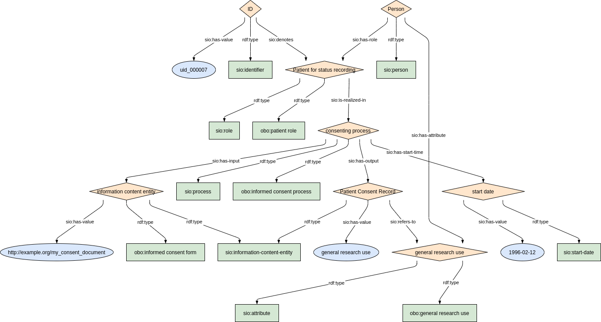
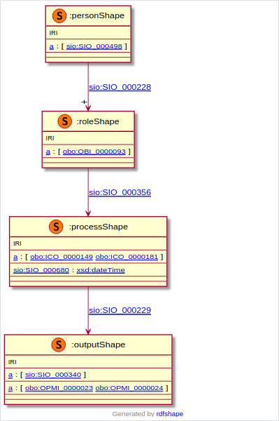

### Semantic model figure

This module describes the data elements related to consent from the group 'Research'. It specifically covers the CDE elements 7.1.'Agreement to be contacted for research purposes' and 7.2.'Consent to the reuse of data'. 
These elements, defined by the JRC, can be found on the EU RD Platform at [this link](https://eu-rd-platform.jrc.ec.europa.eu/sites/default/files/CDS/EU_RD_Platform_CDS_Final.pdf).

<p align="center">
    <a href="../images/rdf/8_Consent.png" target="_blank">
        
    </a>
</p>


***
### Example RDF (turtle)

```ttl
@prefix : <http://purl.org/ejp-rd/cde/v1/example-rdf/> .
@prefix obo: <http://purl.obolibrary.org/obo/> .
@prefix sio: <http://semanticscience.org/resource/> .
@prefix xsd: <http://www.w3.org/2001/XMLSchema#> .
@prefix rdfs: <http://www.w3.org/2000/01/rdf-schema#> .

:identifier_ a sio:SIO_000115 ;
    sio:SIO_000020 :consent_role_ ;
    sio:SIO_000300 "uid_000008"^^xsd:string .

:person_ a sio:SIO_000498 ;
    sio:SIO_000228 :consent_role_ ;
    sio:SIO_000008 :consent_attribute_ .

:consent_role_  a obo:OBI_0000093, sio:SIO_000016;
    rdfs:label "Patient for status recording"^^xsd:string;
    sio:SIO_000356 :consent_process_ .

:consent_process_ a obo:OBI_0000810 ;
    rdfs:label "consenting process"^^xsd:string;
    sio:SIO_000229 :consent_output_ ;
    sio:SIO_000230 :consent_input_ ;
    sio:SIO_000680 :consent_startdate_ .

:consent_output_ a sio:SIO_000015 ;
    rdfs:label "Patient Consent Record"^^xsd:string ;
    sio:SIO_000300 "general research use"^^xsd:string ; 
    sio:SIO_000628 :consent_attribute_ .   

:consent_input_ a sio:SIO_000015, obo:ICO_0000001 ;
    rdfs:label "information content entity"^^xsd:string ;
    sio:SIO_000300 "http://example.org/my_consent_document"^^xsd:string .

:consent_attribute_ a sio:SIO_000614, <http://example.org/my_consent_document> ;
    rdfs:label "general research use"^^xsd:string .

:consent_startdate_ a sio:SIO_000031 ;
    sio:SIO_000300 "1999-01-01"^^xsd:date .
```

### Validation artifacts 
##### ShEx figure

<p align="center">
    <a href="../images/shex/8_Consent.png" target="_blank">
        
    </a>
</p>


***
##### ShEx

```ShEx
PREFIX : <http://purl.org/ejp-rd/cde/v1/shex/>
PREFIX obo: <http://purl.obolibrary.org/obo/> 
PREFIX sio: <http://semanticscience.org/resource/>
PREFIX xsd: <http://www.w3.org/2001/XMLSchema#>
PREFIX rdfs: <http://www.w3.org/2000/01/rdf-schema#>

:identifierShape IRI {
    a [sio:SIO_000115] ;
    rdfs:label xsd:string? ;
    sio:SIO_000020 @:consentRoleShape ;
    sio:SIO_000300 xsd:string
}

:personShape IRI { 
    a [sio:SIO_000498] ;
    rdfs:label xsd:string? ;
    sio:SIO_000228 @:consentRoleShape ;
    sio:SIO_000008 @:consentAttributeShape
}

:consentRoleShape IRI {
    a [obo:OBI_0000093] ;
    a [sio:SIO_000016] ;
    rdfs:label xsd:string? ;
    sio:SIO_000356 @:consentProcessShape
}

:consentProcessShape IRI {
    a [obo:OBI_0000810] ;
    rdfs:label xsd:string? ;
    sio:SIO_000680 @:consentStartDateShape ;
    sio:SIO_000229 @:patientconsentOutputShape ;
    sio:SIO_000230 @:consentInputShape
}

:patientconsentOutputShape IRI {
    a [sio:SIO_000015] ;
    rdfs:label xsd:string? ;
    sio:SIO_000300 xsd:string ;
    sio:SIO_000628 @:consentAttributeShape
}

:consentInputShape IRI {
    a [sio:SIO_000015] ;
    a [obo:ICO_0000001] ;
    rdfs:label xsd:string? ;
    sio:SIO_000300 xsd:string
}

:consentAttributeShape IRI {
    a [sio:SIO_000614] ;
    a IRI ;
    rdfs:label xsd:string? ;
}

:consentStartDateShape IRI {
    a [sio:SIO_000031] ;
    rdfs:label xsd:string? ;
    sio:SIO_000300 xsd:date
}
```

