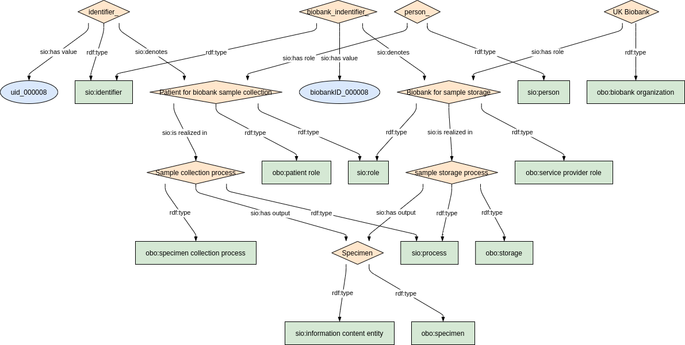

### Semantic model figure

This module describes the data elements related to biological samples stored in a biobank. It specifically covers the CDE elements 7.3.'Biological Sample' and 7.4.'Link to a biobank'. 
These elements, defined by the JRC, can be found on the EU RD Platform at [this link](https://eu-rd-platform.jrc.ec.europa.eu/sites/default/files/CDS/EU_RD_Platform_CDS_Final.pdf).

<p align="center">
    <a href="../images/rdf/9_Biobank.png" target="_blank">
        
    </a>
</p>

***

### Example RDF (turtle)

```ttl
@prefix : <http://purl.org/ejp-rd/cde/v1/example-rdf/> .
@prefix obo: <http://purl.obolibrary.org/obo/> .
@prefix sio: <http://semanticscience.org/resource/> .
@prefix xsd: <http://www.w3.org/2001/XMLSchema#> .
@prefix rdfs: <http://www.w3.org/2000/01/rdf-schema#> .
@prefix dc: <http://purl.org/dc/elements/1.1/> .

:identifier_ a sio:SIO_000115 ;
    sio:SIO_000020 :specimen_role_ ;
    sio:SIO_000300 "uid_000008"^^xsd:string .

:person_ a sio:SIO_000498 ;
    sio:SIO_000228 :specimen_role_ .

:specimen_role_  a obo:OBI_0000093, sio:SIO_000016 ;
    rdfs:label "Patient for biobank sample collection"^^xsd:string ;
    sio:SIO_000356 :specimen_process_ .

:specimen_process_ a sio:SIO_000006, obo:OBI_0000659 ;
    rdfs:label "Sample collection process"^^xsd:string ;
    sio:SIO_000229 :specimen_output_ .

:specimen_output_ a sio:SIO_000015, obo:OBI_0100051 ;
    rdfs:label "Specimen"^^xsd:string .

:biobank_identifier_ a sio:SIO_000115 ;
    sio:SIO_000020 :biobank_role_ ;
    sio:SIO_000300 "biobankID_000008"^^xsd:string .

:biobank_ a obo:OMIABIS_0000010 ;
    sio:SIO_000228 :biobank_role_ ;
    rdfs:label "UK Biobank"^^xsd:string .

:biobank_role_  a obo:OBI_0000947, sio:SIO_000016;
    rdfs:label "Biobank for sample storage"^^xsd:string ;
    sio:SIO_000356 :biobank_process_ .

:biobank_process_ a sio:SIO_000006, obo:OBI_0302893 ;
    rdfs:label "sample storage process"^^xsd:string ;
    sio:SIO_000229 :specimen_output_ .
```

***

### Validation artifacts 
##### ShEx figure

<p align="center">
    <a href="../images/shex/9_Biobanks.png" target="_blank">
        
    </a>
</p>

***
##### ShEx

``` ShEx
TODO
```
