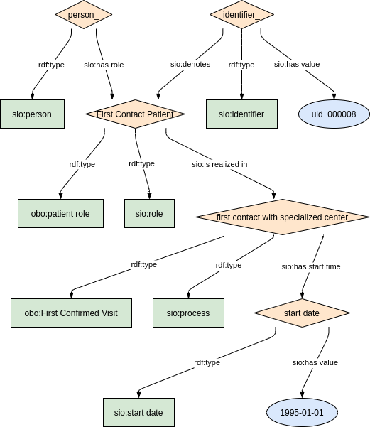

### Semantic model figure

This module describes the data elements related to the 'Care pathway'. It specifically covers the CDE element 4.1.'First contact with specialised centre'. 
These elements, defined by the JRC, can be found on the EU RD Platform at [this link](https://eu-rd-platform.jrc.ec.europa.eu/sites/default/files/CDS/EU_RD_Platform_CDS_Final.pdf).

<p align="center">
    <a href="../images/rdf/4_Care_pathway.png" target="_blank">
        
    </a>
</p>


***

### Example RDF (turtle)

```ttl
@prefix : <http://purl.org/ejp-rd/cde/v1/example-rdf/> .
@prefix obo: <http://purl.obolibrary.org/obo/> .
@prefix sio: <http://semanticscience.org/resource/> .
@prefix xsd: <http://www.w3.org/2001/XMLSchema#> .
@prefix rdfs: <http://www.w3.org/2000/01/rdf-schema#> .

:identifier_ a sio:SIO_000115 ;
    sio:SIO_000020 :carepathway_role_ ;
    sio:SIO_000300 "uid_000008"^^xsd:string .

:person_ a sio:SIO_000498;
    sio:SIO_000228 :carepathway_role_ .

:carepathway_role_  a obo:OBI_0000093, sio:SIO_000016;
    rdfs:label "First Contact Patient"^^xsd:string;
    sio:SIO_000356 :carepathway_process_ .

:carepathway_process_ a sio:SIO_000006, obo:NCIT_C159705 ;
    rdfs:label "first contact with specialized center"^^xsd:string;
    sio:SIO_000680 :carepathway_startdate_ .

:carepathway_startdate_ a sio:SIO_000031 ;
    sio:SIO_000300 "1995-01-01"^^xsd:date .
```

***

### Validation artifacts 
##### ShEx figure

<p align="center">
    <a href="../images/shex/4_Care_pathway.png" target="_blank">
        
    </a>
</p>


***

##### ShEx

``` ShEx
PREFIX : <http://purl.org/ejp-rd/cde/v1/shex/>
PREFIX obo: <http://purl.obolibrary.org/obo/> 
PREFIX sio: <http://semanticscience.org/resource/>
PREFIX xsd: <http://www.w3.org/2001/XMLSchema#>
PREFIX rdfs: <http://www.w3.org/2000/01/rdf-schema#>

:identifierShape IRI {
    a [sio:SIO_000115] ;
    sio:SIO_000020 @:carePathwayRoleShape ;
    rdfs:label xsd:string? ;
    sio:SIO_000300 xsd:string
}

:personShape IRI { 
    a [sio:SIO_000498] ;
    rdfs:label xsd:string? ;
    sio:SIO_000228 @:carePathwayRoleShape
}

:carePathwayRoleShape IRI {
    a [obo:OBI_0000093] ;
    a [sio:SIO_000016] ;
    rdfs:label xsd:string? ;
    sio:SIO_000356 @:carePathwayProcessShape
}

:carePathwayProcessShape IRI {
    a [sio:SIO_000006] ;
    a [obo:NCIT_C159705] ;
    rdfs:label xsd:string? ;
    sio:SIO_000680 @:carePathwayStartDateShape
}

:carePathwayStartDateShape IRI {
    a [sio:SIO_000031] ;
    rdfs:label xsd:string? ;
    sio:SIO_000300 xsd:date
}
```
