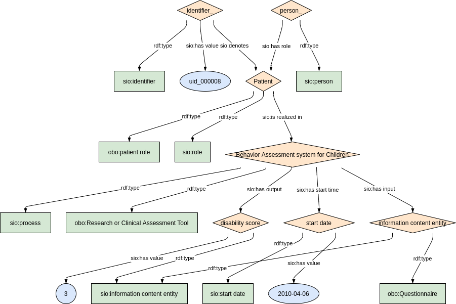
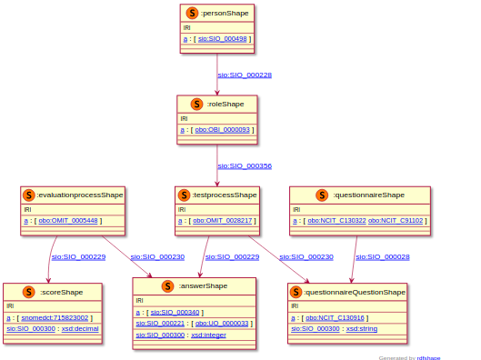

### Semantic model figure

<p align="center">
    <a href="../images/rdf/10_Disability.png" target="_blank">
        
    </a>
</p>


***

### Example RDF (turtle)

```ttl
@prefix : <http://purl.org/ejp-rd/cde/v020/example-rdf/> .
@prefix sio: <http://semanticscience.org/resource/> .
@prefix obo: <http://purl.obolibrary.org/obo/> .
@prefix xsd: <http://www.w3.org/2001/XMLSchema#> .
@prefix snomedct: <http://purl.bioontology.org/ontology/SNOMEDCT/> .

:person_ a sio:SIO_000498 ;
   sio:SIO_000228 :role_ .

:role_ a obo:OBI_0000093 ;
   sio:SIO_000356 :test_process_ .

:questionnaire_document_ a obo:NCIT_C130322, obo:NCIT_C91102  ; 
   sio:SIO_000028 :questionnaire_question_ .

:questionnaire_question_ a obo:NCIT_C130916 ;
   sio:SIO_000300 "How many days difficulty present?"^^xsd:string .

:test_process_ a obo:OMIT_0028217 ; 
   sio:SIO_000230 :questionnaire_question_ ;
   sio:SIO_000229 :answer_ .

:answer_ a sio:SIO_000340 ; 
   sio:SIO_000221 obo:UO_0000033 ; 
   sio:SIO_000300 "1"^^xsd:integer .

:evaluation_process_ a obo:OMIT_0005448 ; 
   sio:SIO_000230 :answer_ ;
   sio:SIO_000229 :score_ .

:score_ a snomedct:715823002 ;
   sio:SIO_000300 "22.3"^^xsd:decimal .
```

***

### Validation artifacts 
##### ShEx figure

<p align="center">
    <a href="../images/shex/10_Disability.png" target="_blank">
        
    </a>
</p>


***
##### ShEx

``` ShEx
PREFIX : <http://purl.org/ejp-rd/cde/v020/shex/>
PREFIX obo: <http://purl.obolibrary.org/obo/> 
PREFIX sio: <http://semanticscience.org/resource/>
PREFIX snomedct: <http://purl.bioontology.org/ontology/SNOMEDCT/>
PREFIX xsd: <http://www.w3.org/2001/XMLSchema#> 

:personShape IRI {
  a [ sio:SIO_000498 ] ;
  sio:SIO_000228 @:roleShape 
}

:roleShape IRI {
  a [ obo:OBI_0000093 ] ;
  sio:SIO_000356 @:testprocessShape
}

:questionnaireShape IRI {
  a [ obo:NCIT_C130322  obo:NCIT_C91102 ] ;
  sio:SIO_000028 @:questionnaireQuestionShape
}

:questionnaireQuestionShape IRI {
  a [ obo:NCIT_C130916 ] ;
  sio:SIO_000300 xsd:string
}

:testprocessShape IRI {
  a [ obo:OMIT_0028217 ] ;
  sio:SIO_000230 @:questionnaireQuestionShape ;
  sio:SIO_000229 @:answerShape
}

:answerShape IRI {
  a [ sio:SIO_000340 ] ;
  sio:SIO_000221 [obo:UO_0000033] ;
  sio:SIO_000300 xsd:integer
}

:evaluationprocessShape IRI {
  a [ obo:OMIT_0005448 ] ;
  sio:SIO_000230 @:answerShape ;
  sio:SIO_000229 @:scoreShape ;
}

:scoreShape IRI {
  a [ snomedct:715823002 ] ;
  sio:SIO_000300 xsd:decimal
}
```
