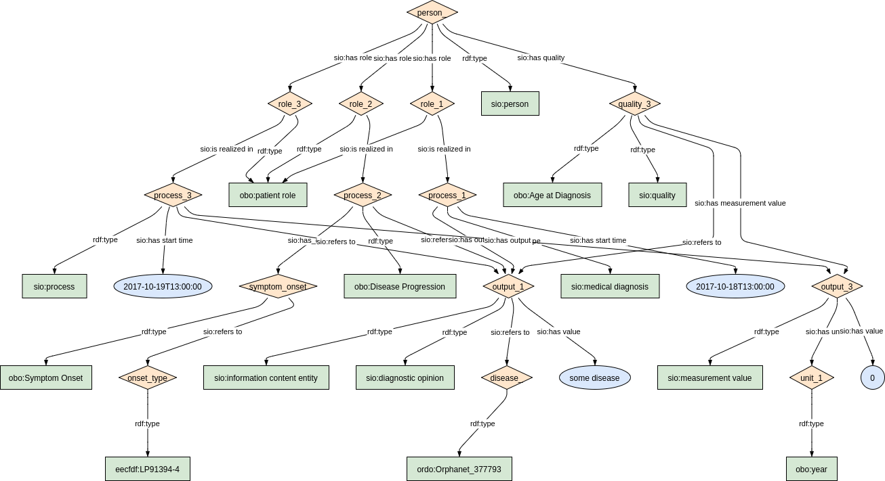

### Semantic model figure

<p align="center">
    <a href="../images/rdf/5_Disease_history_and_diagnosis.png" target="_blank">
        
    </a>
</p>

***

### Example rdf (turtle)

```ttl
@prefix : <http://purl.org/ejp-rd/cde/v020/example-rdf/> .
@prefix sio: <http://semanticscience.org/resource/> .
@prefix obo: <http://purl.obolibrary.org/obo/> .
@prefix xsd: <http://www.w3.org/2001/XMLSchema#> .
@prefix ordo: <http://www.orpha.net/ORDO/> .
@prefix loinc: <http://purl.bioontology.org/ontology/LNC/> .

:person_ a sio:SIO_000498 ;
    sio:SIO_000228 :role_ ;
    sio:SIO_000217 :quality_1, :quality_2 .

:role_ a obo:OBI_0000093;
    sio:SIO_000356 :process_1;
    sio:SIO_000356 :process_2;
    sio:SIO_000356 :process_3 .

:process_1 a sio:SIO_001001 ;
  sio:SIO_000229 :output_1;
  sio:SIO_000680  "2017-10-18T13:00:00"^^xsd:dateTime .
  
:process_2 a sio:SIO_000006 ;
  sio:SIO_000229 :output_2;
  sio:SIO_000230 :output_1;
  sio:SIO_000680  "2015-10-18T13:00:00"^^xsd:dateTime .  
  
:process_3 a sio:SIO_000006 ;
  sio:SIO_000229 :output_3;
  sio:SIO_000230 :output_1;
  sio:SIO_000680  "2017-10-19T13:00:00"^^xsd:dateTime .    

:output_1 a sio:SIO_000340, sio:SIO_000015; 
  sio:SIO_000628 :disease_ .
  
:disease_ a ordo:Orphanet_377793.

:output_2 a sio:SIO_000340,  loinc:LP91394-4.  

:output_3 a sio:SIO_000340,  loinc:LP91394-4. 

:quality_1 a obo:NCIT_C124353 ;
    sio:SIO_000216 :output_2 .

:quality_2 a obo:NCIT_C156420  ;
    sio:SIO_000216 :output_3 .
```

Mark's example

```ttl
@prefix rdf: <http://www.w3.org/1999/02/22-rdf-syntax-ns#> .
@prefix sio: <http://semanticscience.org/resource/> .
@prefix obo: <http://purl.obolibrary.org/obo/> .
@prefix rdfs: <http://www.w3.org/2000/01/rdf-schema#> .
@prefix dbsnp: <http://identifiers.org/dbsnp:> .
@prefix hgnc: <https://identifiers.org/hgnc:> .
@prefix bioass: <http://www.bioassayontology.org/bao#> .
@prefix rdcmeta: <http://rdf.biosemantics.org/ontologies/rd-connect/> .
@prefix ex: <http://example.org/> .

ex:birthdayquality
    sio:has-measurement-value <http://example.org/birthdayquality#MV1> ;
    a obo:NCIT_C68615 ;
    rdfs:label "Birth Date" .

<http://example.org/birthdayquality#MV1>
    sio:has-value "2015-10-18T13:00:00"^^<http://www.w3.org/2001/XMLSchema#dateTime> ;
    a sio:measurement-value ;
    rdfs:label "2010-10-10" .

ex:patientID
    sio:denotes ex:patientrole ;
    sio:has-value "123456"^^<http://www.w3.org/2001/XMLSchema#int> ;
    a rdcmeta:Pseudonym, sio:identifier ;
    rdfs:label "123456" .

ex:patientX
    obo:RO_0002162 ex:patienttaxon ;
    sio:has-quality ex:birthdayquality, ex:symptomquality ;
    sio:has-role ex:patientrole ;
    a sio:patient .

ex:patientrole
    a sio:patient-role, sio:role ;
    rdfs:label "Patient role" .

ex:patienttaxon
    a obo:NCBITaxon_9606 ;
    rdfs:label "some taxon" .

ex:symptomquality
    sio:has-measurement-value <http://example.org/symptomquality#MV2> ;
    a obo:NCIT_C124353 ;
    rdfs:label "Symptom Onset" .

<http://example.org/symptomquality#MV2>
    sio:has-value "2015-10-18T13:00:00"^^<http://www.w3.org/2001/XMLSchema#dateTime> ;
    a sio:measurement-value .

obo:NCBITaxon_9606
    rdfs:label "Homo sapiens" .

obo:NCIT_C124353
    rdfs:label "Symptom Onset" .

obo:NCIT_C68615
    rdfs:label "Birth Date" .

rdcmeta:Pseudonym
    rdfs:label "Pseudonym" .

sio:identifier
    rdfs:label "identifier" .

sio:measurement-value
    rdfs:label "2010-10-10", "This will depend on what symptom has been measured..." .

sio:patient
    rdfs:label "Patient" .

sio:patient-role
    rdfs:label "Patient role" .

sio:role
    rdfs:label "Role" .
```

***

### Validation artifacts 
##### ShEx figure

<p align="center">
    <a href="../images/shex/5_Disease_history_and_diagnosis.png" target="_blank">
        
    </a>
</p>

***

##### ShEx

Person's diagnosis

``` ShEx
PREFIX : <http://purl.org/ejp-rd/cde/v020/shex/>
PREFIX obo: <http://purl.obolibrary.org/obo/>
PREFIX sio: <http://semanticscience.org/resource/>
PREFIX xsd: <http://www.w3.org/2001/XMLSchema#>
PREFIX loinc: <http://purl.bioontology.org/ontology/LNC/>
PREFIX snomedct: <http://purl.bioontology.org/ontology/SNOMEDCT/>


:personShape IRI {
  a [sio:SIO_000498];
  sio:SIO_000228 @:personRoleShape;
  sio:SIO_000217 @:ageAtDiagnosisQualityShape;
  sio:SIO_000217 @:symptomOnsetQualityShape
}

:personRoleShape IRI {
  a [obo:OBI_0000093];
  sio:SIO_000356 @:processShape +
}

:processShape IRI {
  (a [sio:SIO_000006];
  sio:SIO_000230 @:outputReferToDiseaseShape;
  sio:SIO_000229 @:outputShape
  |
  a [sio:SIO_001001];
  sio:SIO_000229 @:outputReferToDiseaseShape
  );
  sio:SIO_000680 xsd:dateTime
}

:outputShape IRI {
  a [sio:SIO_000340];
  a [loinc:LP91394-4 snomedct:263675000 snomedct:373068000]
}

:outputReferToDiseaseShape IRI {
  a [sio:SIO_000340];
  a [sio:SIO_000015];
  sio:SIO_000628 @:diseaseShape
}

:diseaseShape IRI {
  a IRI /^http:\/\/www.orpha.net\/ORDO\/Orphanet_/
}


:ageAtDiagnosisQualityShape IRI {
  a [obo:NCIT_C156420];
  sio:SIO_000216 @:outputShape
}

:symptomOnsetQualityShape IRI {
  a [obo:NCIT_C124353];
  sio:SIO_000216 @:outputShape
}
```
