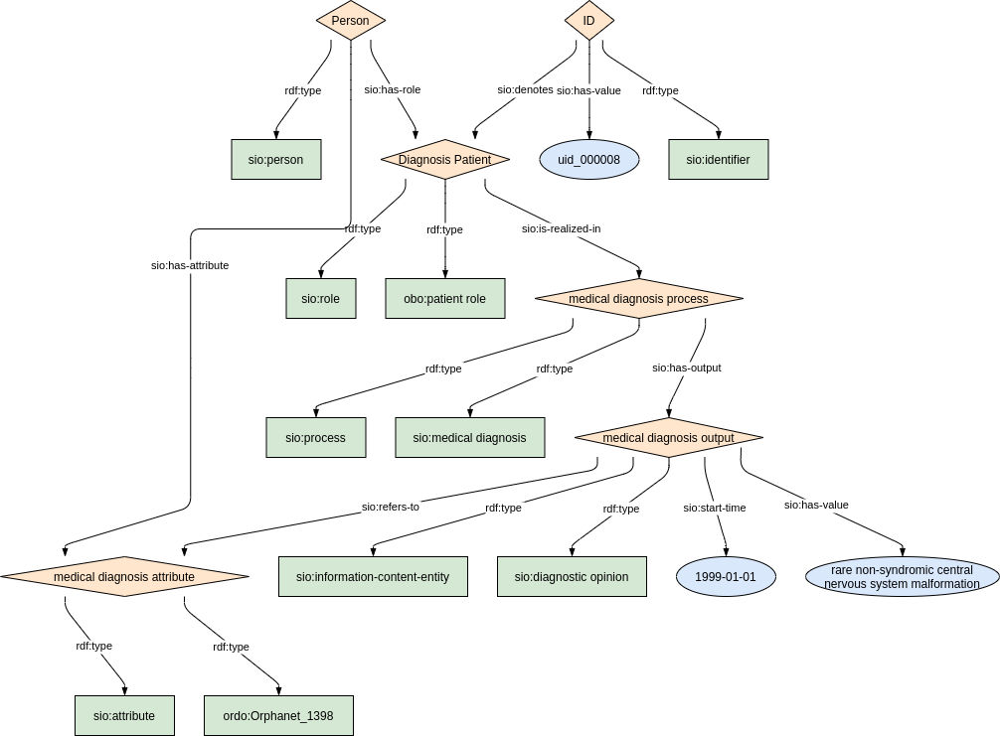
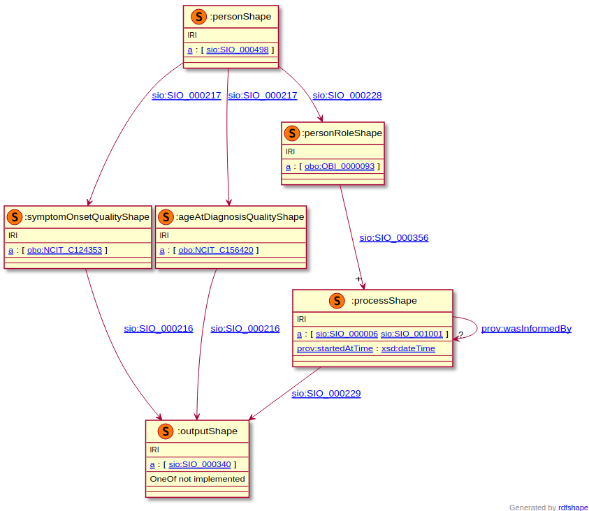
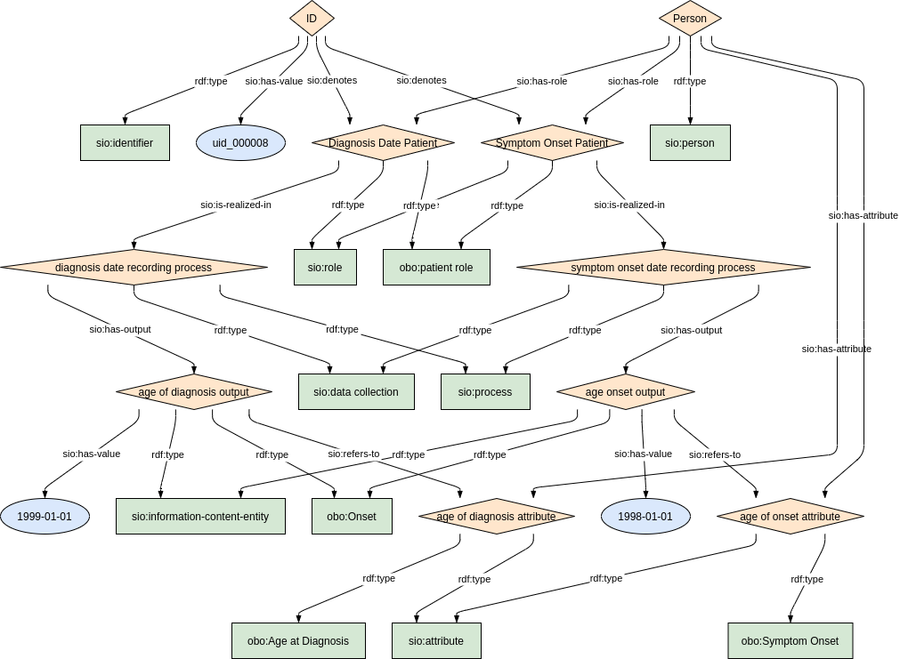

## Diagnosis

This module describes the data elements related to the diagnosis combining elements from the groups 'Disease history' and 'Diagnosis'. It specifically covers the CDE elements 5.1.'Age at onset', 5.2.'Age at diagnosis' and 6.1.'Diagnosis of the rare disease'. 
These elements, defined by the JRC, can be found on the EU RD Platform at [this link](https://eu-rd-platform.jrc.ec.europa.eu/sites/default/files/CDS/EU_RD_Platform_CDS_Final.pdf).

### Semantic model figure

<p align="center">
    <a href="../images/rdf/5_Diagnosis.png" target="_blank">
        
    </a>
</p>

***

### Example RDF (turtle)

```ttl
@prefix : <http://purl.org/ejp-rd/cde/v1/example-rdf/> .
@prefix obo: <http://purl.obolibrary.org/obo/> .
@prefix sio: <http://semanticscience.org/resource/> .
@prefix xsd: <http://www.w3.org/2001/XMLSchema#> .
@prefix rdfs: <http://www.w3.org/2000/01/rdf-schema#> .

:identifier_ a sio:SIO_000115 ;
    sio:SIO_000020 :diagnosis_role_ ;
    sio:SIO_000300 "uid_000007"^^xsd:string .

:person_ a sio:SIO_000498;
    sio:SIO_000228 :diagnosis_role_ ;
    sio:SIO_000008 :diagnosis_attribute_ .

:diagnosis_role_ a obo:OBI_0000093, sio:SIO_000016 ;
    rdfs:label "Diagnosis Patient"^^xsd:string;
    sio:SIO_000356 :diagnosis_process_ .

:diagnosis_process_ a sio:SIO_000006, sio:SIO_001001 ;
    rdfs:label "medical diagnosis"^^xsd:string ;
    sio:SIO_000680 :diagnosis_startdate_ ;
    sio:SIO_000229 :diagnosis_output_ .

:diagnosis_output_ a sio:SIO_000015, sio:SIO_001003 ;
    rdfs:label "rare non-syndromic central nervous system malformation characterized by complete or near-complete absence of the cerebellum with a normal sized posterior fossa, possibly accompanied by hypoplasia of the brainstem."^^xsd:string ;
    sio:SIO_000300 "rare non-syndromic central nervous system malformation characterized by complete or near-complete absence of the cerebellum with a normal sized posterior fossa, possibly accompanied by hypoplasia of the brainstem."^^xsd:string ;
    sio:SIO_000628 :diagnosis_attribute_ .

:diagnosis_attribute_ a sio:SIO_000614, <http://www.orpha.net/ORDO/Orphanet_1400> ;
    rdfs:label "rare non-syndromic central nervous system malformation characterized by complete or near-complete absence of the cerebellum with a normal sized posterior fossa, possibly accompanied by hypoplasia of the brainstem."^^xsd:string .

:diagnosis_startdate_ a sio:SIO_000031 ;
    sio:SIO_000300 "1996-02-12"^^xsd:date .
```


***

### Validation artifacts 
##### ShEx figure

<p align="center">
    <a href="../images/shex/5_Disease_history_and_diagnosis.png" target="_blank">
        
    </a>
</p>

***

##### ShEx

``` ShEx
PREFIX : <http://purl.org/ejp-rd/cde/v1/shex/>
PREFIX obo: <http://purl.obolibrary.org/obo/> 
PREFIX sio: <http://semanticscience.org/resource/>
PREFIX xsd: <http://www.w3.org/2001/XMLSchema#>
PREFIX rdfs: <http://www.w3.org/2000/01/rdf-schema#>

:identifierShape IRI {
    a [sio:SIO_000115] ;
    sio:SIO_000020 @:medicalDiagnosisRoleShape ;
    rdfs:label xsd:string? ;
    sio:SIO_000300 xsd:string
}

:personShape IRI { 
    a [sio:SIO_000498] ;
    rdfs:label xsd:string? ;
    sio:SIO_000228 @:medicalDiagnosisRoleShape ;
    sio:SIO_000008 @:medicalDiagnosisAttributeShape
}

:medicalDiagnosisRoleShape IRI {
    a [obo:OBI_0000093] ;
    a [sio:SIO_000016] ;
    rdfs:label xsd:string? ;
    sio:SIO_000356 @:medicalDiagnosisProcessShape
}

:medicalDiagnosisProcessShape IRI {
    a [sio:SIO_000006] ;
    a [sio:SIO_001001] ;
    rdfs:label xsd:string? ;
    sio:SIO_000680 @:medicalDiagnosisStartDateShape ;
    sio:SIO_000229 @:medicalDiagnosisOutputShape
}

:medicalDiagnosisOutputShape IRI {
    a [sio:SIO_000015] ;
    a [sio:SIO_001003] ;
    rdfs:label xsd:string? ;
    sio:SIO_000300 xsd:string ;
    sio:SIO_000628 @:medicalDiagnosisAttributeShape
}

:medicalDiagnosisAttributeShape IRI {
    a [sio:SIO_000614] ;
    a IRI /^http:\/\/www.orpha.net\/ORDO\/Orphanet_/ ;
    rdfs:label xsd:string?
}

:medicalDiagnosisStartDateShape IRI {
    a [sio:SIO_000031] ;
    rdfs:label xsd:string? ;
    sio:SIO_000300 xsd:date
}
```


## Disease_history

### Semantic model figure

<p align="center">
    <a href="../images/rdf/5_Disease_history.png" target="_blank">
        
    </a>
</p>

***

### Example RDF (turtle)

```ttl
@prefix : <http://purl.org/ejp-rd/cde/v1/example-rdf/> .
@prefix obo: <http://purl.obolibrary.org/obo/> .
@prefix sio: <http://semanticscience.org/resource/> .
@prefix xsd: <http://www.w3.org/2001/XMLSchema#> .
@prefix rdfs: <http://www.w3.org/2000/01/rdf-schema#> .

:identifier_ a sio:SIO_000115 ;
    sio:SIO_000020 :symptom_onset_role_ ;
    sio:SIO_000020 :diagnosis_date_role_ ;
    sio:SIO_000300 "uid_000008"^^xsd:string .

:person_ a sio:SIO_000498;
    sio:SIO_000228 :symptom_onset_role_ ;
    sio:SIO_000008 :symptom_onset_attribute_ ;
    sio:SIO_000228 :diagnosis_date_role_ ;
    sio:SIO_000008 :diagnosis_date_attribute_ .

:symptom_onset_role_  a obo:OBI_0000093, sio:SIO_000016;
    rdfs:label "Symptom Onset Patient"^^xsd:string;
    sio:SIO_000356 :symptom_onset_process_ .

:symptom_onset_process_ a sio:SIO_000006, sio:SIO_001052 ;
    rdfs:label "data collection - symptom onset date recording process"^^xsd:string;
    sio:SIO_000229 :symptom_onset_output_ .

:symptom_onset_output_ a sio:SIO_000015, obo:HP_0030674 ;
    rdfs:label "date of onset (in official CDE this is age of onset)"^^xsd:string ;
    sio:SIO_000300 "1998-06-08"^^xsd:date ;  
    sio:SIO_000628 :symptom_onset_attribute_ .

:symptom_onset_attribute_ a sio:SIO_000614, obo:NCIT_C124353  ;
    rdfs:label "Age at onset"^^xsd:string .

:diagnosis_date_role_  a obo:OBI_0000093, sio:SIO_000016 ;
    rdfs:label "Diagnosis Date Patient"^^xsd:string ;
    sio:SIO_000356 :diagnosis_date_process_ .

:diagnosis_date_process_ a sio:SIO_000006, sio:SIO_001052 ;
    rdfs:label "data collection - diagnosis date recording process"^^xsd:string ;
    sio:SIO_000229 :diagnosis_date_output_ .

:diagnosis_date_output_ a sio:SIO_000015, obo:HP_0030674 ;
    rdfs:label "age at diagnosis"^^xsd:string ;
    sio:SIO_000300 "1999-06-08"^^xsd:date ;
    sio:SIO_000628 :diagnosis_date_attribute_ .

:diagnosis_date_attribute_ a sio:SIO_000614, obo:NCIT_C156420 ;
    rdfs:label "Age at diagnosis"^^xsd:string .
```


***

### Validation artifacts 
##### ShEx figure

<p align="center">
    <a href="../images/shex/5_Disease_history_and_diagnosis.png" target="_blank">
        
    </a>
</p>

***

##### ShEx


``` ShEx
PREFIX : <http://purl.org/ejp-rd/cde/v1/shex/>
PREFIX obo: <http://purl.obolibrary.org/obo/> 
PREFIX sio: <http://semanticscience.org/resource/>
PREFIX xsd: <http://www.w3.org/2001/XMLSchema#>
PREFIX rdfs: <http://www.w3.org/2000/01/rdf-schema#>

:identifierShape IRI {
    a [sio:SIO_000115] ;
    rdfs:label xsd:string? ;
    sio:SIO_000020 @:symptomOnsetRoleShape ;
    sio:SIO_000020 @:diagnosisDateRoleShape;
    sio:SIO_000300 xsd:string  
}

:personShape IRI { 
    a [sio:SIO_000498] ;
    rdfs:label xsd:string? ;
    sio:SIO_000228 @:symptomOnsetRoleShape ;
    sio:SIO_000008 @:symptomOnsetAttributeShape ;
    sio:SIO_000228 @:diagnosisDateRoleShape ;
    sio:SIO_000008 @:diagnosisDateAttributeShape
}

:symptomOnsetRoleShape IRI {
    a [obo:OBI_0000093] ;
    a [sio:SIO_000016] ;
    rdfs:label xsd:string? ;
    sio:SIO_000356 @:symptomOnsetProcessShape
}

:symptomOnsetProcessShape IRI {
    a [sio:SIO_000006] ;
    a [sio:SIO_001052] ;
    rdfs:label xsd:string? ;
    sio:SIO_000229 @:symptomOnsetOutputShape
}

:symptomOnsetOutputShape IRI {
    a [sio:SIO_000015] ;
    a [obo:HP_0030674 obo:HP_0003577 obo:NCIT_C124294 obo:HP_0003674] ;
    rdfs:label xsd:string? ;
    sio:SIO_000300 xsd:date ;
    sio:SIO_000628 @:symptomOnsetAttributeShape
}

:symptomOnsetAttributeShape IRI {
    a [sio:SIO_000614] ;
    a [obo:NCIT_C124353] ;
    rdfs:label xsd:string?
}

:diagnosisDateRoleShape IRI {
    a [obo:OBI_0000093] ;
    a [sio:SIO_000016] ;
    rdfs:label xsd:string? ;
    sio:SIO_000356 @:diagnosisDateProcessShape
}

:diagnosisDateProcessShape IRI {
    a [sio:SIO_000006] ;
    a [sio:SIO_001052] ;
    rdfs:label xsd:string? ;
    sio:SIO_000229 @:diagnosisDateOutputShape
}

:diagnosisDateOutputShape IRI {
    a [sio:SIO_000015] ;
    a [obo:HP_0030674 obo:HP_0003577 obo:NCIT_C124294 obo:HP_0003674] ;
    rdfs:label xsd:string? ;
    sio:SIO_000300 xsd:date ;
    sio:SIO_000628 @:diagnosisDateAttributeShape
}

:diagnosisDateAttributeShape IRI {
    a [sio:SIO_000614] ;
    a [obo:NCIT_C156420] ;
    rdfs:label xsd:string?
}
```
