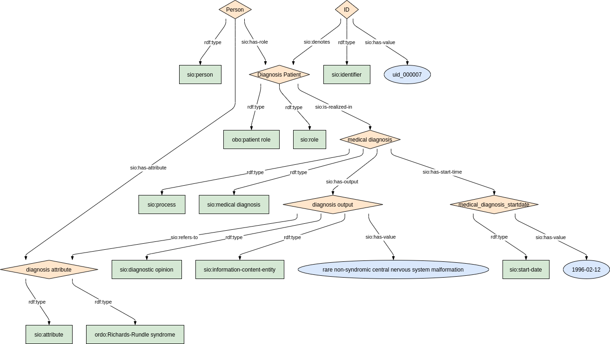
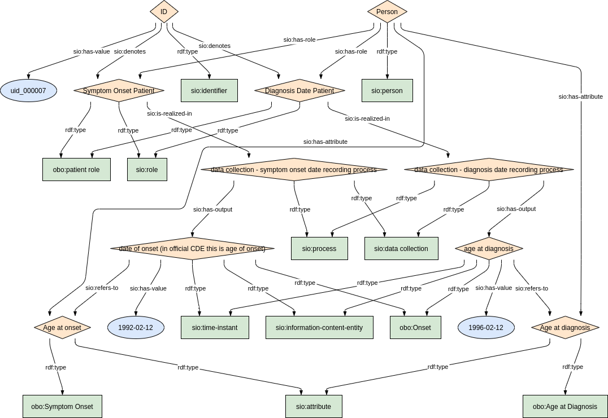

## Diagnosis

### Semantic model figure

<p align="center">
    <a href="../images/rdf/5_Diagnosis.png" target="_blank">
        
    </a>
</p>

***

### Example RDF (turtle)

```ttl
TODO
```


***

### Validation artifacts 
##### ShEx figure

<p align="center">
    <a href="../images/shex/5_Disease_history_and_diagnosis.png" target="_blank">
        
    </a>
</p>

***

##### ShEx

``` ShEx
TODO
```


## Disease_history

### Semantic model figure

<p align="center">
    <a href="../images/rdf/5_Disease_history.png" target="_blank">
        
    </a>
</p>

***

### Example RDF (turtle)

```ttl
TODO
```


***

### Validation artifacts 
##### ShEx figure

<p align="center">
    <a href="../images/shex/5_Disease_history_and_diagnosis.png" target="_blank">
        
    </a>
</p>

***

##### ShEx


``` ShEx
TODO
```
