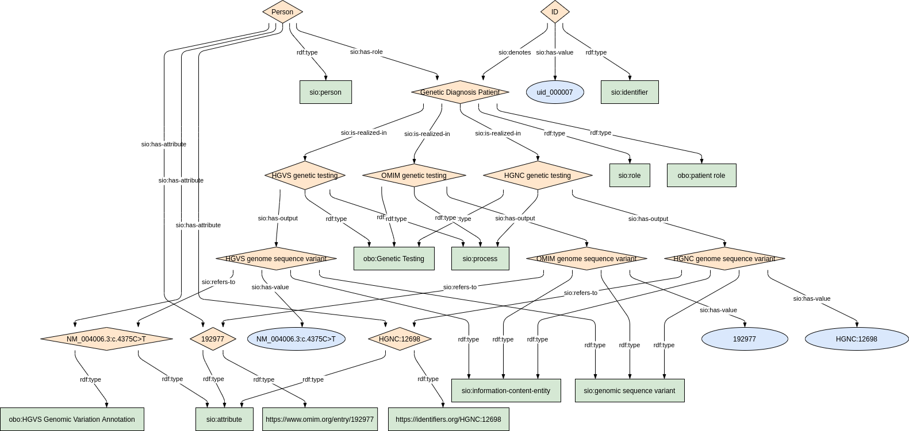
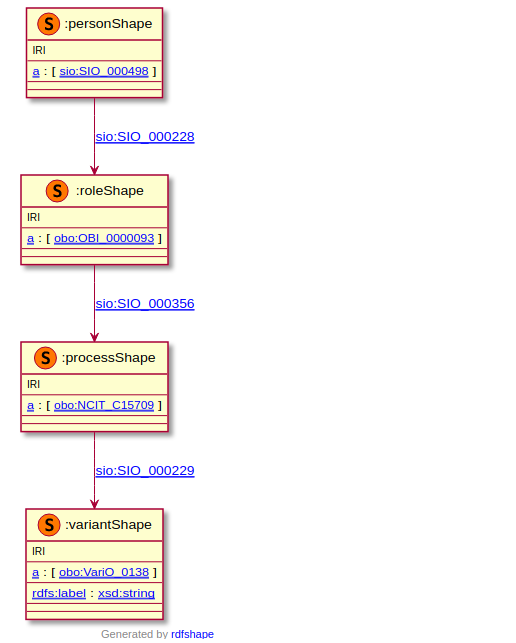

### Semantic model figure

<p align="center">
    <a href="../images/rdf/6_Genetic_diagnosis.png" target="_blank">
        
    </a>
</p>


***
### Example RDF (turtle)

```ttl
TODO
```

### Validation artifacts 

##### ShEx figure

<p align="center">
    <a href="../images/shex/6_Genetic_diagnosis.png" target="_blank">
        
    </a>
</p>


***

##### ShEx

``` ShEx
TODO
```
