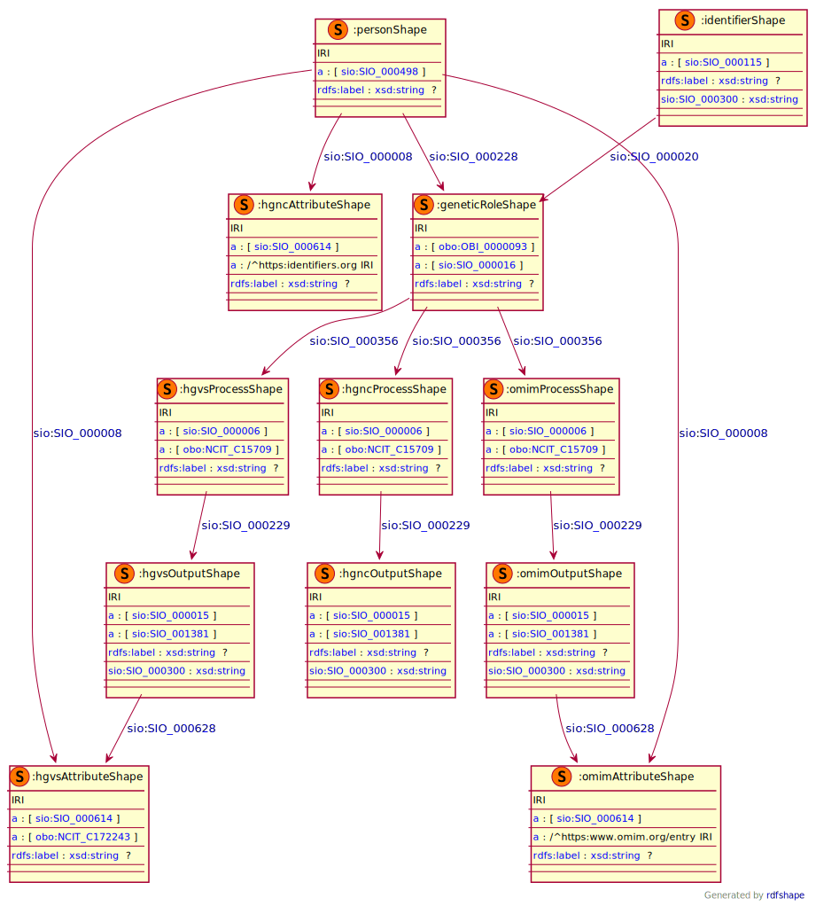

### Semantic model figure

This module describes the data element 6.2'Genetic Diagnosis' which is part of the group 'Diagnosis'. 
These elements, defined by the JRC, can be found on the EU RD Platform at [this link](https://eu-rd-platform.jrc.ec.europa.eu/sites/default/files/CDS/EU_RD_Platform_CDS_Final.pdf).

<p align="center">
    <a href="../images/rdf/6_Genetic_diagnosis.png" target="_blank">
        
    </a>
</p>


***
### Example RDF (turtle)

```ttl
@prefix : <http://purl.org/ejp-rd/cde/v1/example-rdf/> .
@prefix obo: <http://purl.obolibrary.org/obo/> .
@prefix sio: <http://semanticscience.org/resource/> .
@prefix xsd: <http://www.w3.org/2001/XMLSchema#> .
@prefix rdfs: <http://www.w3.org/2000/01/rdf-schema#> .

:identifier_ a sio:SIO_000115 ;
    sio:SIO_000020 :genetic_role_ ;
    sio:SIO_000300 "uid_000008"^^xsd:string .

:person_ a sio:SIO_000498;
    sio:SIO_000228 :genetic_role_ ;
    sio:SIO_000008 :hgvs_attribute_ ;
    sio:SIO_000008 :omim_attribute_ ;
    sio:SIO_000008 :hgnc_attribute_ .

:genetic_role_  a obo:OBI_0000093, sio:SIO_000016;
    rdfs:label "Genetic Diagnosis Patient"^^xsd:string;
    sio:SIO_000356 :hgvs_process_ ;
    sio:SIO_000356 :omim_process_ ;
    sio:SIO_000356 :hgnc_process_ .

:hgvs_process_ a sio:SIO_000006, obo:NCIT_C15709 ;
    rdfs:label "genetic testing"^^xsd:string;
    sio:SIO_000229 :hgvs_output_ .

:hgvs_output_ a sio:SIO_000015, sio:SIO_001381;
    rdfs:label "HGVS genome sequence variant"^^xsd:string ;
    sio:SIO_000300 "NM_004006.3:c.4375C>T"^^xsd:string;
    sio:SIO_000628 :hgvs_attribute_ .

:hgvs_attribute_ a sio:SIO_000614, obo:NCIT_C172243 ;
    rdfs:label "NM_004006.3:c.4375C>T"^^xsd:string .

:omim_process_ a sio:SIO_000006, obo:NCIT_C15709 ;
    rdfs:label "genetic testing"^^xsd:string;
    sio:SIO_000229 :omim_output_ .

:omim_output_ a sio:SIO_000015, sio:SIO_001381;
    rdfs:label "OMIM genome sequence variant"^^xsd:string ;
    sio:SIO_000300 "192977"^^xsd:string;
    sio:SIO_000628 :omim_attribute_ .

:omim_attribute_ a sio:SIO_000614, <https://www.omim.org/entry/192977> ;
    rdfs:label "192977"^^xsd:string .

:hgnc_process_ a sio:SIO_000006, obo:NCIT_C15709 ;
    rdfs:label "genetic testing"^^xsd:string;
    sio:SIO_000229 :hgnc_output_ .

:hgnc_output_ a sio:SIO_000015, sio:SIO_001381;
    rdfs:label "HGNC genome sequence variant"^^xsd:string ;
    sio:SIO_000300 "HGNC:12698"^^xsd:string;
    sio:SIO_000628 :hgnc_attribute_ .

:hgnc_attribute_ a sio:SIO_000614, <https://identifiers.org/HGNC:12698> ;
    rdfs:label "HGNC:12698"^^xsd:string .
```

### Validation artifacts 

##### ShEx figure

<p align="center">
    <a href="../images/shex/6_Genetic_diagnosis.svg" target="_blank">
        
    </a>
</p>


***

##### ShEx

``` ShEx
PREFIX : <http://purl.org/ejp-rd/cde/v1/shex/>
PREFIX obo: <http://purl.obolibrary.org/obo/> 
PREFIX sio: <http://semanticscience.org/resource/>
PREFIX xsd: <http://www.w3.org/2001/XMLSchema#>
PREFIX rdfs: <http://www.w3.org/2000/01/rdf-schema#>

:identifierShape IRI {
    a [sio:SIO_000115] ;
    rdfs:label xsd:string? ;
    sio:SIO_000020 @:geneticRoleShape ;
    sio:SIO_000300 xsd:string
}

:personShape IRI { 
    a [sio:SIO_000498] ;
    rdfs:label xsd:string? ;
    sio:SIO_000228 @:geneticRoleShape ;
    sio:SIO_000008 @:hgvsAttributeShape ;
    sio:SIO_000008 @:omimAttributeShape ;
    sio:SIO_000008 @:hgncAttributeShape
}

:geneticRoleShape IRI {
    a [obo:OBI_0000093] ;
    a [sio:SIO_000016] ;
    rdfs:label xsd:string? ;
    sio:SIO_000356 @:hgvsProcessShape ;
    sio:SIO_000356 @:omimProcessShape ;
    sio:SIO_000356 @:hgncProcessShape
}

# HGVS

:hgvsProcessShape IRI {
    a [sio:SIO_000006] ;
    a [obo:NCIT_C15709] ;
    rdfs:label xsd:string? ;
    sio:SIO_000229 @:hgvsOutputShape
}

:hgvsOutputShape IRI {
    a [sio:SIO_000015] ;
    a [sio:SIO_001381] ;
    rdfs:label xsd:string? ;
    sio:SIO_000300 xsd:string ;
    sio:SIO_000628 @:hgvsAttributeShape
}

:hgvsAttributeShape IRI { 
    a [sio:SIO_000614] ;
    a [obo:NCIT_C172243] ;
    rdfs:label xsd:string? 
}

# OMIM

:omimProcessShape IRI {
    a [sio:SIO_000006] ;
    a [obo:NCIT_C15709] ;
    rdfs:label xsd:string? ;
    sio:SIO_000229 @:omimOutputShape
}

:omimOutputShape IRI {
    a [sio:SIO_000015] ;
    a [sio:SIO_001381] ;
    rdfs:label xsd:string? ;
    sio:SIO_000300 xsd:string ;
    sio:SIO_000628 @:omimAttributeShape
}

:omimAttributeShape IRI {
    a [sio:SIO_000614] ;
    a IRI  /^https:\/\/www.omim.org\/entry\// ;
    rdfs:label xsd:string?
}

# HGNC

:hgncProcessShape IRI {
    a [sio:SIO_000006] ;
    a [obo:NCIT_C15709] ;
    rdfs:label xsd:string? ;
    sio:SIO_000229 @:hgncOutputShape
}

:hgncOutputShape IRI {
    a [sio:SIO_000015] ;
    a [sio:SIO_001381] ;
    rdfs:label xsd:string? ;
    sio:SIO_000300 xsd:string
}

:hgncAttributeShape IRI {
    a [sio:SIO_000614] ;
    a IRI /^https:\/\/identifiers.org\// ;
    rdfs:label xsd:string?
}
```
