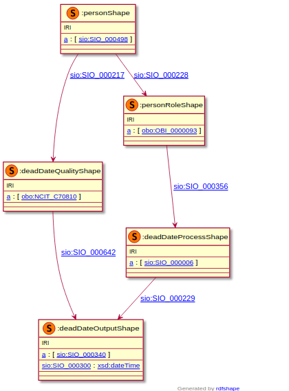

### Semantic model figure

<p align="center">
    <a href="../images/rdf/3_Patient_status.png" target="_blank">
        
    </a>
</p>


***

### Example rdf (turtle)

An example rdf of person's status

```ttl
@prefix : <http://purl.org/ejp-rd/cde/v020/example-rdf/> .
@prefix obo: <http://purl.obolibrary.org/obo/> .
@prefix sio: <http://semanticscience.org/resource/> .

:person_ a sio:SIO_000498 ;
  sio:SIO_000228 :role_ ;
  sio:SIO_000217 :quality_ . 

:role_ a obo:OBI_0000093 ;
  sio:SIO_000356 :process_ .

:process_ a sio:SIO_000006 ;
  sio:SIO_000229 :output_ .

:output_ a obo:PATO_0001421 .

:quality_ a obo:NCIT_C25688 ;
  sio:SIO_000642 :output_ .
```

An example rdf of person's dead date

```ttl
@prefix : <http://purl.org/ejp-rd/cde/v020/example-rdf/> .
@prefix obo: <http://purl.obolibrary.org/obo/> .
@prefix sio: <http://semanticscience.org/resource/> .
@prefix xsd: <http://www.w3.org/2001/XMLSchema#> .

:person_ a sio:SIO_000498 ;
  sio:SIO_000228 :role_ ;
  sio:SIO_000217 :quality_ . 

:role_ a obo:OBI_0000093;
  sio:SIO_000356 :process_ .

:process_ a sio:SIO_000006 ;
  sio:SIO_000229 :output_ .

:output_ a sio:SIO_000340 ;
  sio:SIO_000300  "1990-01-01T01:12:50"^^xsd:dateTime .

:quality_ a obo:NCIT_C70810 ;
  sio:SIO_000642 :output_ .
```

***

### Validation artifacts 
##### ShEx figure

Person's status

<p align="center">
    <a href="../images//3_Patient_status.png" target="_blank">
        
    </a>
</p>

***
Person's dead date

<p align="center">
    <a href="../images/shex/3_Patient_status_dead_date.png" target="_blank">
        
    </a>
</p>


***

##### ShEx

Person's status

``` ShEx
PREFIX : <http://purl.org/ejp-rd/cde/v020/shex/>
PREFIX obo: <http://purl.obolibrary.org/obo/>
PREFIX sio: <http://semanticscience.org/resource/>
PREFIX snomedct: <http://purl.bioontology.org/ontology/SNOMEDCT/>
PREFIX hl7: <http://purl.bioontology.org/ontology/HL7/>

:personShape IRI {
  a [sio:SIO_000498];
  sio:SIO_000228 @:personRoleShape;
  sio:SIO_000217 @:statusQualityShape
}

:personRoleShape IRI {
  a [obo:OBI_0000093];
  sio:SIO_000356 @:statusProcessShape
}

:statusProcessShape IRI {
  a [sio:SIO_000006];
  sio:SIO_000229 @:outputShape
}

:outputShape IRI {
  a [obo:PATO_0001422 obo:PATO_0001421  snomedct:399307001 hl7:C4291647]
}

:statusQualityShape IRI {
  a [obo:NCIT_C25688];
  sio:SIO_000642 @:outputShape
}
```

Person's dead date

``` ShEx
PREFIX : <http://purl.org/ejp-rd/cde/v020/shex/>
PREFIX obo: <http://purl.obolibrary.org/obo/>
PREFIX sio: <http://semanticscience.org/resource/>
PREFIX xsd: <http://www.w3.org/2001/XMLSchema#>

:personShape IRI {
  a [sio:SIO_000498];
  sio:SIO_000228 @:personRoleShape;
  sio:SIO_000217 @:deadDateQualityShape
}

:personRoleShape IRI {
  a [obo:OBI_0000093];
  sio:SIO_000356 @:deadDateProcessShape
}

:deadDateProcessShape IRI {
  a [sio:SIO_000006];
  sio:SIO_000229 @:deadDateOutputShape
}

:deadDateOutputShape IRI {
  a [sio:SIO_000340];
  sio:SIO_000300 xsd:dateTime
}

:deadDateQualityShape IRI {
  a [obo:NCIT_C70810];
  sio:SIO_000642 @:deadDateOutputShape
}
```

