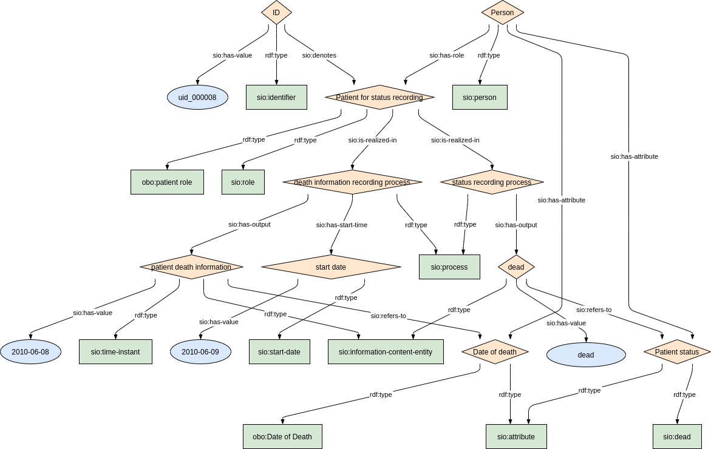

### Semantic model figure

<p align="center">
    <a href="../images/rdf/3_Patient_status.png" target="_blank">
        
    </a>
</p>


***

### Example RDF (turtle)

An example RDF of person's status

```ttl
TODO
```

An example RDF of person's dead date

```ttl
TODO
```

***

### Validation artifacts 
##### ShEx figure

Person's status

<p align="center">
    <a href="../images/shex/3_Patient_status.png" target="_blank">
        
    </a>
</p>

***
Person's dead date

<p align="center">
    <a href="../images/shex/3_Patient_status_dead_date.png" target="_blank">
        
    </a>
</p>


***

##### ShEx

Person's status

``` ShEx
TODO
```

Person's dead date

``` ShEx
TODO
```

