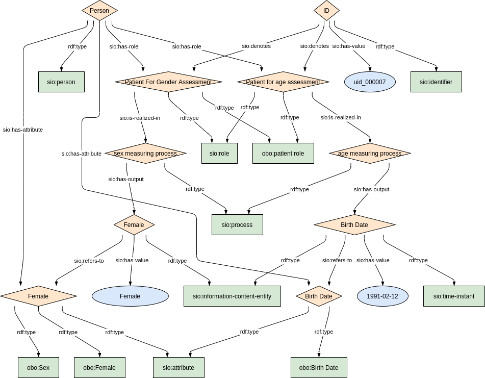
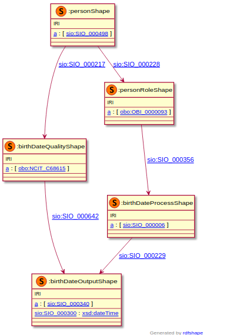
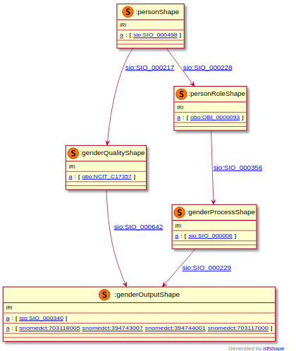

### Semantic model figure

<p align="center">
    <a href="../images/rdf/2_Personal_information.png" target="_blank">
        
    </a>
</p>


***

### Example RDF (turtle)

An example RDF of person's birthdate

```ttl
TODO
```

An example RDF of person's gender

```ttl

TODO
```

***

### Validation artifacts 
##### ShEx figure

Date of birth

<p align="center">
    <a href="../images/shex/2_Personal_information_birthdate.png" target="_blank">
        
    </a>
</p>

***
Gender

<p align="center">
    <a href="../images/shex/2_Personal_information_gender.png" target="_blank">
        
    </a>
</p>


***

##### ShEx
Date of birth

```
TODO
```

Gender

```
TODO
```
