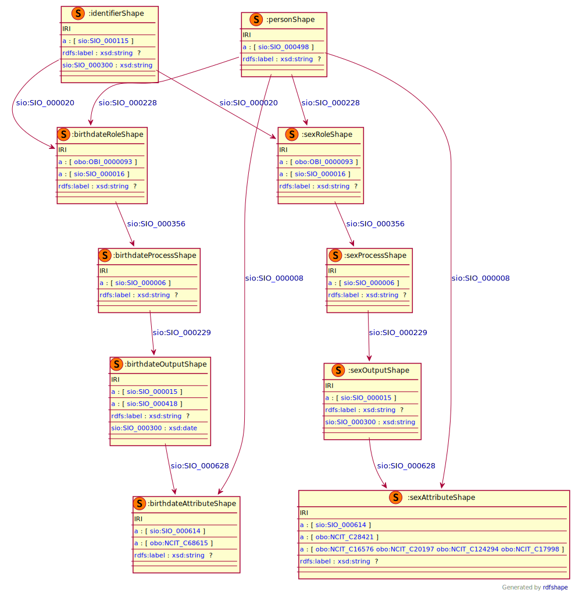

### Semantic model figure

This module describes the data elements in the CDE 'Personal information' group. It specifically covers the CDE elements 2.1.'Date of Birth' and 2.2.'Sex'. 
These elements, defined by the JRC, can be found on the EU RD Platform at [this link](https://eu-rd-platform.jrc.ec.europa.eu/sites/default/files/CDS/EU_RD_Platform_CDS_Final.pdf).

<p align="center">
    <a href="../images/rdf/2_Personal_information.png" target="_blank">
        
    </a>
</p>


***

### Example RDF (turtle)

```ttl
@prefix : <http://purl.org/ejp-rd/cde/v1/example-rdf/> .
@prefix obo: <http://purl.obolibrary.org/obo/> .
@prefix sio: <http://semanticscience.org/resource/> .
@prefix xsd: <http://www.w3.org/2001/XMLSchema#> .
@prefix rdfs: <http://www.w3.org/2000/01/rdf-schema#> .

:identifier_ a sio:SIO_000115 ;
    sio:SIO_000020 :birthdate_role_ ;
    sio:SIO_000020 :sex_role_ ;
    sio:SIO_000300 "uid_000008"^^xsd:string .

:person_ a sio:SIO_000498;
    sio:SIO_000228 :birthdate_role_ ;
    sio:SIO_000008 :birthdate_attribute_ ;
    sio:SIO_000228 :sex_role_ ;
    sio:SIO_000008 :sex_attribute_ .

:birthdate_role_  a obo:OBI_0000093, sio:SIO_000016 ;
    rdfs:label "Patient for age assessment"^^xsd:string ;
    sio:SIO_000356 :birthdate_process_ .

:birthdate_process_ a sio:SIO_000006 ;
    rdfs:label "age measuring process"^^xsd:string;
    sio:SIO_000229 :birthdate_output_ .

:birthdate_output_ a sio:SIO_000015, sio:SIO_000418 ;
    rdfs:label "Birth Date"^^xsd:string ;
    sio:SIO_000300 "1995-01-01"^^xsd:date ;
    sio:SIO_000628 :birthdate_attribute_ .

:birthdate_attribute_ a sio:SIO_000614, obo:NCIT_C68615 ;
    rdfs:label "Birth Date"^^xsd:string .

:sex_role_  a obo:OBI_0000093, sio:SIO_000016;
    rdfs:label "Patient For Gender Assessment"^^xsd:string ;
    sio:SIO_000356 :sex_process_ .

:sex_process_ a sio:SIO_000006 ;
    rdfs:label "sex measuring process"^^xsd:string ;
    sio:SIO_000229 :sex_output_ .

:sex_output_ a sio:SIO_000015;
    rdfs:label "Male"^^xsd:string ;
    sio:SIO_000300 "Male"^^xsd:string ;
    sio:SIO_000628 :sex_attribute_ .

:sex_attribute_ a sio:SIO_000614, obo:NCIT_C28421, obo:NCIT_C20197 ;
    rdfs:label "Male"^^xsd:string .
```

***

### Validation artifacts 
##### ShEx figure

<p align="center">
    <a href="../images/shex/2_Personal_information.svg" target="_blank">
        
    </a>
</p>

***


##### ShEx

```
PREFIX : <http://purl.org/ejp-rd/cde/v1/shex/>
PREFIX obo: <http://purl.obolibrary.org/obo/> 
PREFIX sio: <http://semanticscience.org/resource/>
PREFIX xsd: <http://www.w3.org/2001/XMLSchema#>
PREFIX rdfs: <http://www.w3.org/2000/01/rdf-schema#>

# Birthdate

:identifierShape IRI {
    a [sio:SIO_000115];
    rdfs:label xsd:string? ;
    sio:SIO_000020 @:birthdateRoleShape ;
    sio:SIO_000020 @:sexRoleShape ;
    sio:SIO_000300 xsd:string
}

:personShape IRI { 
    a [sio:SIO_000498] ;
    rdfs:label xsd:string? ;
    sio:SIO_000228 @:birthdateRoleShape ;
    sio:SIO_000008 @:birthdateAttributeShape ;
    sio:SIO_000228 @:sexRoleShape ;
    sio:SIO_000008 @:sexAttributeShape
}

:birthdateRoleShape IRI {
    a [obo:OBI_0000093] ;
    a [sio:SIO_000016] ;
    rdfs:label xsd:string? ;
    sio:SIO_000356 @:birthdateProcessShape
}

:birthdateProcessShape IRI {
    a [sio:SIO_000006] ;
    rdfs:label xsd:string? ;
    sio:SIO_000229 @:birthdateOutputShape
}

:birthdateOutputShape IRI {
    a [sio:SIO_000015] ;
    a [sio:SIO_000418] ;
    rdfs:label xsd:string? ;
    sio:SIO_000300 xsd:date ;
    sio:SIO_000628 @:birthdateAttributeShape
}

:birthdateAttributeShape IRI {
    a [sio:SIO_000614] ;
    a [obo:NCIT_C68615] ;
    rdfs:label xsd:string?
}

:sexRoleShape IRI {
    a [obo:OBI_0000093] ;
    a [sio:SIO_000016] ;
    rdfs:label xsd:string? ;
    sio:SIO_000356 @:sexProcessShape
}

:sexProcessShape IRI {
    a [sio:SIO_000006] ;
    rdfs:label xsd:string? ;
    sio:SIO_000229 @:sexOutputShape
}

:sexOutputShape IRI {
    a [sio:SIO_000015] ;
    rdfs:label xsd:string? ;
    sio:SIO_000300 xsd:string ;
    sio:SIO_000628 @:sexAttributeShape
}

:sexAttributeShape IRI {
    a [sio:SIO_000614] ;
    a [obo:NCIT_C28421] ;
    a [obo:NCIT_C16576 obo:NCIT_C20197 obo:NCIT_C124294 obo:NCIT_C17998] ;
    rdfs:label xsd:string? 
}
```

