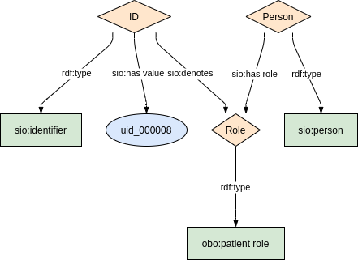
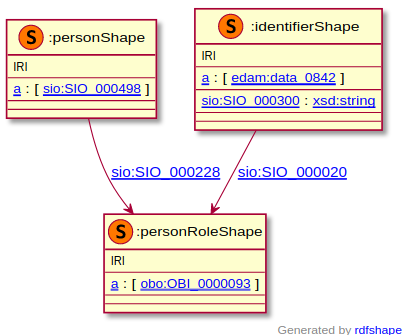

### Semantic model figure

<p align="center">
    <a href="../images/rdf/1_Pseudonym.png" target="_blank">
        
    </a>
</p>

***

### Example RDF (turtle)

```ttl
TODO
```

***
### Validation artifacts 
##### ShEx figure

<p align="center">
    <a href="../images/shex/1_Pseudonym.png" target="_blank">
        
    </a>
</p>

***
##### ShEx

``` ShEx
TODO
```