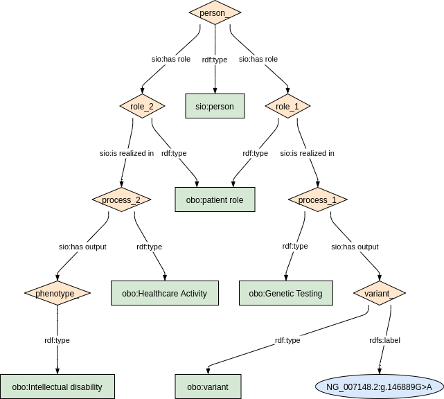

### Semantic model figure

<p align="center">
    <a href="../images/rdf/7_Undiagnosed.png" target="_blank">
        
    </a>
</p>


***
### Example rdf (turtle)

```ttl
@prefix : <http://purl.org/ejp-rd/cde/v020/example-rdf/> .
@prefix sio: <http://semanticscience.org/resource/> .
@prefix obo: <http://purl.obolibrary.org/obo/> .
@prefix xsd: <http://www.w3.org/2001/XMLSchema#> .
@prefix rdfs: <http://www.w3.org/2000/01/rdf-schema#> .

:person_ a sio:SIO_000498 ;
    sio:SIO_000228 :role_1 ;
    sio:SIO_000228 :role_2 .

:role_1 a obo:OBI_0000093 ;
    sio:SIO_000356 :process_1 .    
    
:process_1 a obo:NCIT_C15709 ;
    sio:SIO_000229 :variant_ .
    
:variant_ a obo:VariO_0138;
    rdfs:label "NG_007148.2:g.146889G>A" .    
    
:role_2 a obo:OBI_0000093 ;
    sio:SIO_000356 :process_2 .    
    
:process_2 a obo:NCIT_C16205 ;
    sio:SIO_000229 :phenotype_ .
    
:phenotype_ a obo:HP_0001249 .  
```

Mark's example

```ttl
@prefix rdf: <http://www.w3.org/1999/02/22-rdf-syntax-ns#> .
@prefix sio: <http://semanticscience.org/resource/> .
@prefix obo: <http://purl.obolibrary.org/obo/> .
@prefix rdfs: <http://www.w3.org/2000/01/rdf-schema#> .
@prefix dbsnp: <http://identifiers.org/dbsnp:> .
@prefix hgnc: <https://identifiers.org/hgnc:> .
@prefix bioass: <http://www.bioassayontology.org/bao#> .
@prefix rdcmeta: <http://rdf.biosemantics.org/ontologies/rd-connect/> .
@prefix ex: <http://example.org/> .

ex:medicaldiagnosticprocess
    sio:has-output <http://example.org/medicaldiagnosticprocess#output1> ;
    sio:start-date "2020-10-18T13:00:00"^^<http://www.w3.org/2001/XMLSchema#dateTime> ;
    a sio:medical-diagnosis ;
    rdfs:label "medical diagnostic process" .

<http://example.org/medicaldiagnosticprocess#output1>
    a <https://snomedbrowser.com/Codes/Details/282292002> ;
    rdfs:label "Uncertain Diagnosis" .

ex:patientID
    sio:denotes ex:patientrole ;
    sio:has-value "123456"^^<http://www.w3.org/2001/XMLSchema#int> ;
    a rdcmeta:Pseudonym, sio:identifier ;
    rdfs:label "123456" .

ex:patientX
    obo:RO_0002162 ex:patienttaxon ;
    sio:has-role ex:patientrole ;
    a sio:patient .

ex:patientrole
    sio:is-realized-in ex:medicaldiagnosticprocess ;
    a sio:patient-role, sio:role ;
    rdfs:label "Patient role" .

ex:patienttaxon
    a obo:NCBITaxon_9606 ;
    rdfs:label "some taxon" .

obo:NCBITaxon_9606
    rdfs:label "Homo sapiens" .

rdcmeta:Pseudonym
    rdfs:label "Pseudonym" .

sio:identifier
    rdfs:label "identifier" .

sio:medical-diagnosis
    rdfs:label "Medical Diagnosis" .

sio:patient
    rdfs:label "Patient" .

sio:patient-role
    rdfs:label "Patient role" .

sio:role
    rdfs:label "Role" .

<https://snomedbrowser.com/Codes/Details/282292002>
    rdfs:label "Uncertain Diagnosis" .
```

***

### Validation artifacts 
##### ShEx figure

<p align="center">
    <a href="../images/shex/7_Undiagnosed.png" target="_blank">
        
    </a>
</p>


***

##### ShEx
``` ShEx
PREFIX : <http://purl.org/ejp-rd/cde/v020/shex/>
PREFIX obo: <http://purl.obolibrary.org/obo/> 
PREFIX sio: <http://semanticscience.org/resource/>
PREFIX rdfs: <http://www.w3.org/2000/01/rdf-schema#>
PREFIX xsd: <http://www.w3.org/2001/XMLSchema#> 

:personShape IRI { 
  a [sio:SIO_000498] ;
  sio:SIO_000228 @:geneticTestingRoleShape ;
  sio:SIO_000228 @:healthcareActivityRoleShape
}

:geneticTestingRoleShape IRI {
  a [obo:OBI_0000093] ;
  sio:SIO_000356 @:geneticTestingProcessShape
}

:geneticTestingProcessShape IRI {
  a [obo:NCIT_C15709] ;
  sio:SIO_000229  @:variantShape
}

:variantShape IRI {
  a [obo:VariO_0138] ;
  rdfs:label xsd:string
}

:healthcareActivityRoleShape IRI {
  a [obo:OBI_0000093] ;
  sio:SIO_000356 @:healthcareActivityProcessShape
}

:healthcareActivityProcessShape IRI {
  a [obo:NCIT_C16205] ;
  sio:SIO_000229  @:phenotypeShape
}

:phenotypeShape IRI {
  a IRI /^http:\/\/purl.obolibrary.org\/obo\/HP_/ 
}
```
