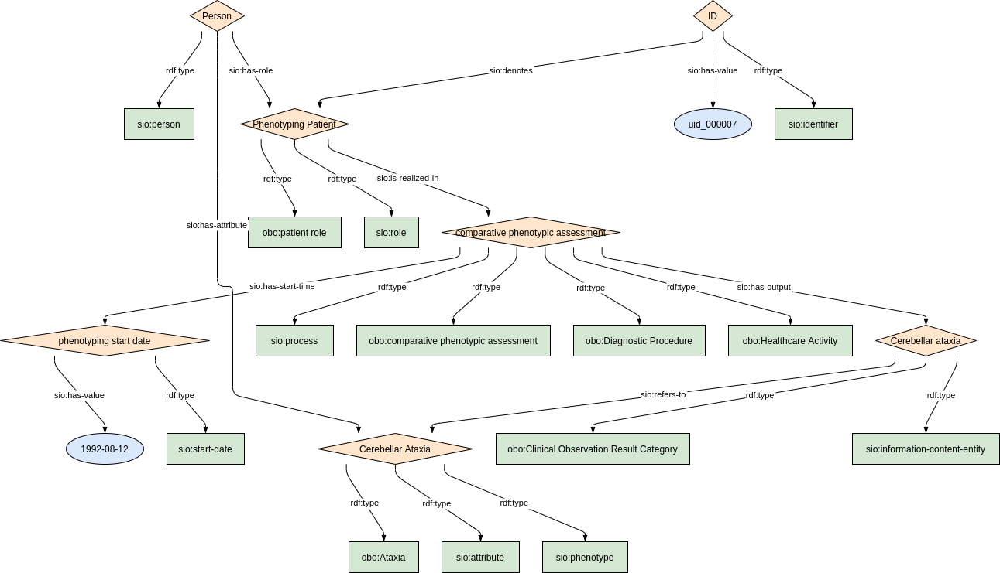

### Semantic model figure

### Undiagnosis

<p align="center">
    <a href="../images/rdf/7_Undiagnosis.png" target="_blank">
        
    </a>
</p>


***
### Example RDF (turtle)

```ttl
@prefix : <http://purl.org/ejp-rd/cde/v020/example-rdf/> .
@prefix sio: <http://semanticscience.org/resource/> .
@prefix obo: <http://purl.obolibrary.org/obo/> .
@prefix xsd: <http://www.w3.org/2001/XMLSchema#> .
@prefix rdfs: <http://www.w3.org/2000/01/rdf-schema#> .

:person_ a sio:SIO_000498 ;
    sio:SIO_000228 :role_1 ;
    sio:SIO_000228 :role_2 .

:role_1 a obo:OBI_0000093 ;
    sio:SIO_000356 :process_1 .    
    
:process_1 a obo:NCIT_C15709 ;
    sio:SIO_000229 :variant_ .
    
:variant_ a obo:VariO_0138;
    rdfs:label "NG_007148.2:g.146889G>A" .    
    
:role_2 a obo:OBI_0000093 ;
    sio:SIO_000356 :process_2 .    
    
:process_2 a obo:NCIT_C16205 ;
    sio:SIO_000229 :phenotype_ .
    
:phenotype_ a obo:HP_0001249 .  
```


***

### Validation artifacts 
##### ShEx figure

<p align="center">
    <a href="../images/shex/7_Undiagnosed.png" target="_blank">
        
    </a>
</p>


***

##### ShEx

```shex
TODO
```


### Phenotyping

<p align="center">
    <a href="../images/rdf/7_Phenotyping.png" target="_blank">
        
    </a>
</p>


***
### Example RDF (turtle)

```ttl
TODO  
```


***

### Validation artifacts 
##### ShEx figure

<p align="center">
    <a href="../images/shex/7_Undiagnosed.png" target="_blank">
        
    </a>
</p>


***

##### ShEx

```shex
TODO
```
