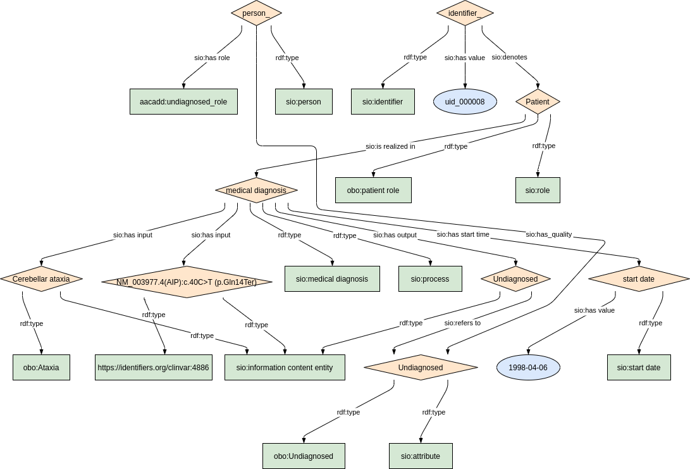

### Semantic model figure

This module describes the data element 6.2'Undiagnosed case' which is part of the group 'Diagnosis'. 
These elements, defined by the JRC, can be found on the EU RD Platform at [this link](https://eu-rd-platform.jrc.ec.europa.eu/sites/default/files/CDS/EU_RD_Platform_CDS_Final.pdf).

### Undiagnosis

<p align="center">
    <a href="../images/rdf/7_Undiagnosis.png" target="_blank">
        
    </a>
</p>


***
### Example RDF (turtle)

```ttl
@prefix : <http://purl.org/ejp-rd/cde/v1/example-rdf/> .
@prefix sio: <http://semanticscience.org/resource/> .
@prefix obo: <http://purl.obolibrary.org/obo/> .
@prefix xsd: <http://www.w3.org/2001/XMLSchema#> .
@prefix rdfs: <http://www.w3.org/2000/01/rdf-schema#> .

:identifier_ a sio:SIO_000115 ;
    sio:SIO_000020 :undiagnosed_role_ ;
    sio:SIO_000300 "uid_000008"^^xsd:string .

:person_ a sio:SIO_000498 ;
    sio:SIO_000228 :undiagnosed_role_ ;
    sio:SIO_000008 :undiagnosed_attribute_ .

:undiagnosed_role_ a obo:OBI_0000093, sio:SIO_000016 ;
    rdfs:label "Patient"^^xsd:string ;
    sio:SIO_000356 :undiagnosed_process_ .    
    
:undiagnosed_process_ a sio:SIO_000006, sio:SIO_001001 ;
    rdfs:label "medical diagnosis"^^xsd:string ;
    sio:SIO_000680 :undiagnosed_startdate_ ;
    sio:SIO_000230 :phenotype_input_ ;
    sio:SIO_000230 :genotype_input_ ;
    sio:SIO_000229 :undiagnosed_output_ .
    
:undiagnosed_output_ a sio:SIO_000015 ;
    rdfs:label "Undiagnosed"^^xsd:string ;
    sio:SIO_000628 :undiagnosed_attribute_ .

:undiagnosed_attribute_ a sio:SIO_000614, obo:NCIT_C113725 ;
    rdfs:label "Undiagnosed"^^xsd:string .

:phenotype_input_ a sio:SIO_000015, <http://purl.obolibrary.org/obo/HP_0001251> ;
    rdfs:label "Cerebellar ataxia"^^xsd:string .

:genotype_input_ a sio:SIO_000015, <https://identifiers.org/clinvar:4886> ;
    rdfs:label "NM_003977.4(AIP):c.40C>T (p.Gln14Ter)"^^xsd:string .

:undiagnosed_startdate_ a sio:SIO_000031 ;
    sio:SIO_000300 "1998-04-06"^^xsd:date . 
```


***

### Validation artifacts 
##### ShEx figure

<p align="center">
    <a href="../images/shex/7_Undiagnosed.png" target="_blank">
        
    </a>
</p>


***

##### ShEx

```shex
TODO
```


### Phenotyping

<p align="center">
    <a href="../images/rdf/7_Phenotyping.png" target="_blank">
        
    </a>
</p>


***
### Example RDF (turtle)

```ttl
@prefix : <http://purl.org/ejp-rd/cde/v1/example-rdf/> .
@prefix obo: <http://purl.obolibrary.org/obo/> .
@prefix sio: <http://semanticscience.org/resource/> .
@prefix xsd: <http://www.w3.org/2001/XMLSchema#> .
@prefix rdfs: <http://www.w3.org/2000/01/rdf-schema#> .

:identifier_ a sio:SIO_000115 ;
    sio:SIO_000020 :phenotypic_role_ ;
    sio:SIO_000300 "uid_000007"^^xsd:string .

:person_ a sio:SIO_000498;
    sio:SIO_000228 :phenotypic_role_ ;
    sio:SIO_000008 :phenotypic_attribute_ .

:phenotypic_role_  a obo:OBI_0000093, sio:SIO_000016 ;
    rdfs:label "Phenotyping Patient"^^xsd:string ;
    sio:SIO_000356 :phenotypic_process_ .

:phenotypic_process_ a sio:SIO_000006, obo:OBI_0001546, obo:NCIT_C16205, obo:NCIT_C18020 ;
    rdfs:label "comparative phenotypic assessment"^^xsd:string ;
    sio:SIO_000680 :phenotypic_startdate_ ;
    sio:SIO_000229 :phenotypic_output_ .

:phenotypic_output_ a sio:SIO_000015, obo:NCIT_C102741 ;
    rdfs:label "Cerebellar ataxia"^^xsd:string ;
    sio:SIO_000628 :phenotypic_attribute_ .

:phenotypic_attribute_ a sio:SIO_000614, sio:SIO_010056, obo:HP_0001251 ;
    rdfs:label "Cerebellar ataxia"^^xsd:string .

:phenotypic_startdate_ a sio:SIO_000031 ;
    sio:SIO_000300 "1992-01-01"^^xsd:date . 
```


***

### Validation artifacts 
##### ShEx figure

<p align="center">
    <a href="../images/shex/7_Undiagnosed.png" target="_blank">
        
    </a>
</p>


***

##### ShEx

```shex
PREFIX : <http://purl.org/ejp-rd/cde/v1/shex/>
PREFIX obo: <http://purl.obolibrary.org/obo/> 
PREFIX sio: <http://semanticscience.org/resource/>
PREFIX rdfs: <http://www.w3.org/2000/01/rdf-schema#>
PREFIX xsd: <http://www.w3.org/2001/XMLSchema#> 

:identifierShape IRI {
    a [sio:SIO_000115] ;
    rdfs:label xsd:string? ;
    sio:SIO_000020 @:undiagnosedRoleShape ;
    sio:SIO_000300 xsd:string
}

:personShape IRI { 
  a [sio:SIO_000498] ;
  rdfs:label xsd:string? ;
  sio:SIO_000228 @:undiagnosedRoleShape ;
  sio:SIO_000008 @:undiagnosedAttributeShape 
}

:undiagnosedRoleShape IRI {
  a [obo:OBI_0000093] ;
  a [sio:SIO_000016] ;
  rdfs:label xsd:string? ;
  sio:SIO_000356 @:undiagnosedProcessShape
}

:undiagnosedProcessShape IRI {
  a [sio:SIO_000006] ;
  a [sio:SIO_001001] ;
  rdfs:label xsd:string? ;
  sio:SIO_000680 @:undiagnosedStartDateShape ;
  sio:SIO_000230 @:phenotypeInputShape ;
  sio:SIO_000230 @:genotypeInputShape ;
  sio:SIO_000229 @:undiagnosedOutputShape 
}

:undiagnosedOutputShape IRI {
  a [sio:SIO_000015] ;
  rdfs:label xsd:string? ;
  sio:SIO_000628 @:undiagnosedAttributeShape
}

:undiagnosedAttributeShape IRI {
  a [sio:SIO_000614] ;
  a [obo:NCIT_C113725] ;
  rdfs:label xsd:string? 
}

:phenotypeInputShape IRI {
  a [sio:SIO_000015] ;
  a IRI /^http:\/\/purl.obolibrary.org\/obo\/HP_/  ;
  rdfs:label xsd:string? 
}

:genotypeInputShape IRI {
  a [sio:SIO_000015] ;
  a IRI /^https:\/\/identifiers.org\// ;
  rdfs:label xsd:string? 
}

:undiagnosedStartDateShape IRI {
    a [sio:SIO_000031] ;
    rdfs:label xsd:string? ;
    sio:SIO_000300 xsd:date
}
```
